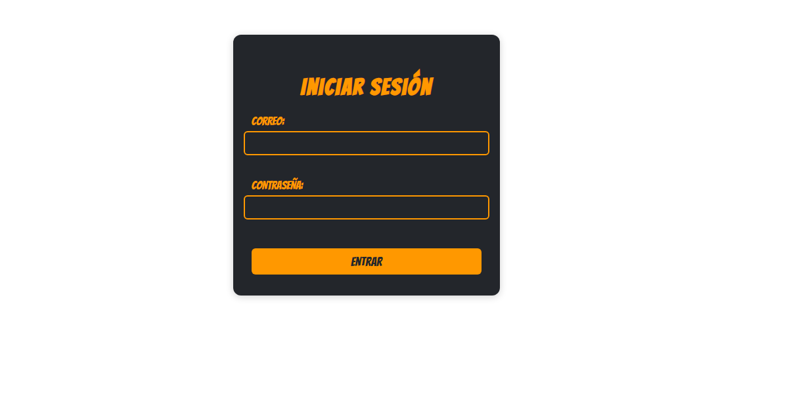
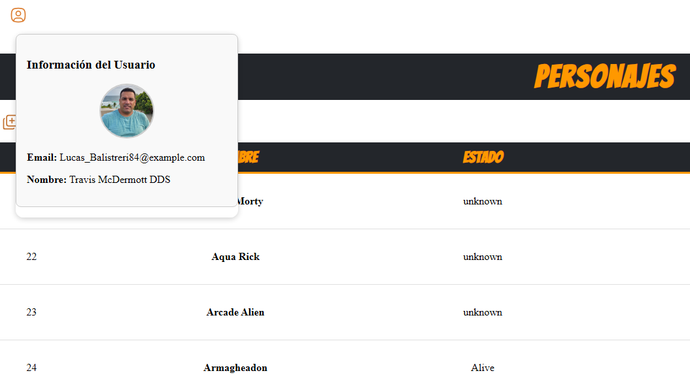
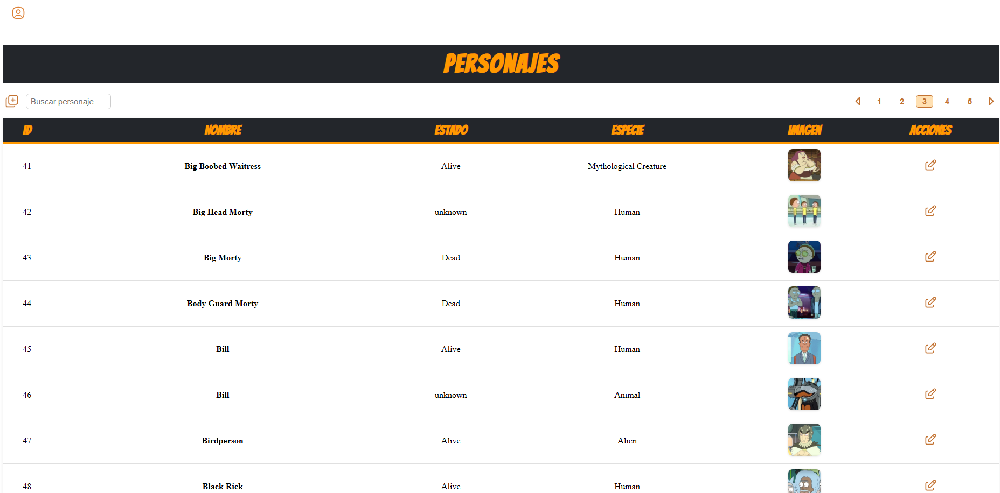
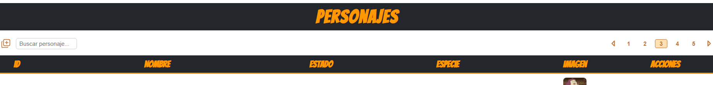
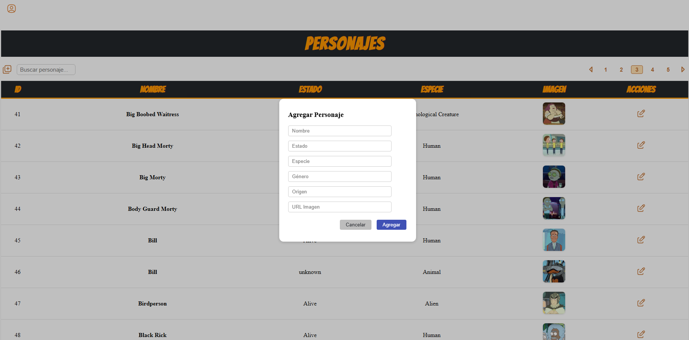
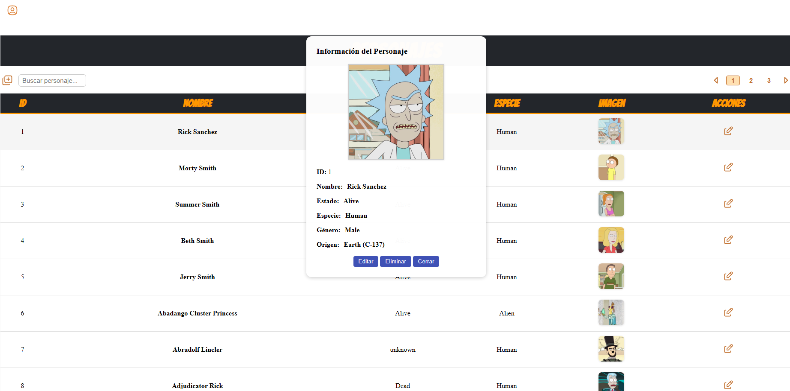

# ProgramApi
Esta aplicación Angular permite gestionar y visualizar personajes consumidos desde una API, con autenticación y funcionalidades interactivas.

## ¿Cómo ejecutar este proyecto?

1. **Instala las dependencias:**
   ```bash
   npm install
   ```
2. **Inicia el servidor de desarrollo:**
   ```bash
   ng serve
   ```
3. **Abre tu navegador en:**
   [http://localhost:4200/](http://localhost:4200/)

La aplicación recargará automáticamente al guardar cambios en los archivos fuente.

## ¿Cómo construir para producción o GitHub Pages?

Para generar la versión lista para producción (por ejemplo, para GitHub Pages):

```bash
ng build --output-path docs --base-href /programApi/
```

Esto creará la carpeta `docs` con todo lo necesario para publicar en GitHub Pages.

---
## Tecnologías y Frameworks

- **Framework Principal:**  
  [Angular 20](https://angular.io/) – Construcción de la SPA.

- **Lenguaje:**  
  [TypeScript](https://www.typescriptlang.org/) – Desarrollo seguro y tipado.

---


### Gestión de Estado

- **NgRx (Store, Effects):**  
  - Estado centralizado y predecible.
  - El store contiene la lista de personajes, filtros, etc.
  - Los efectos gestionan llamadas a la API y otras operaciones asíncronas.

---

### UI y Estilos

- **Angular Material:**  
  - Componentes UI de alta calidad: diálogos modales, tablas, botones y formularios.
  - Basados en [Material Design](https://material.angular.io/).

- **SweetAlert2:**  
  - Alertas y confirmaciones interactivas y visualmente atractivas.

---

### Manejo de Datos y Asincronía

- **RxJS:**  
  - Programación reactiva y manejo eficiente de flujos de datos asíncronos.

- **HttpClientModule:**  
  - Realización de peticiones HTTP a la API REST.

---

### Entorno y Herramientas

- **Node.js** y **npm:**  
  - Entorno de ejecución y gestión de paquetes.

- **Angular CLI:**  
  - Creación, gestión y compilación del proyecto.

---

## APIs Elegidas y Justificación

### 1. API de Datos de Personajes

- **API:** [The Rick and Morty API](https://rickandmortyapi.com/)
- **Justificación:**
  - Pública, gratuita y sin clave de autenticación.
  - Soporte para paginación y filtros de búsqueda.
  - Ideal para mostrar integración con NgRx: carga y filtrado eficiente de datos.

### 2. API de Autenticación (Simulada)

- **Implementación:**
  - Simulación mediante `AuthService`.
  - Permite demostrar un flujo de autenticación completo en Angular.

- **Características:**
  - **Formularios de login:**  
    `login.component.ts`
  - **Servicio de autenticación:**  
    `auth.service.ts` (Valida credenciales y gestiona sesión en `localStorage`)
  - **Guardias de ruta:**  
    `auth.guard.ts` (Protege el acceso a rutas privadas)
---

### Explicacion del codigo (home.ts)
El componente principal HomeComponent es el centro de control de la aplicación tras la autenticación. Aquí se gestiona todo el estado y la lógica de la interfaz de forma local, sin librerías de gestión de estado externas como NgRx.
```typescript
// home.component.ts

export class Home implements OnInit {
  data: any[] = [];           // Datos originales de la página actual
  dataFiltrada: any[] = [];   // Datos que se muestran (filtrados)
  paginaActual: number = 1;   // Página actual de la API
  userId: string = '';        // ID del usuario autenticado

  constructor(private apiService: Api) {}

  ngOnInit(): void {
    this.llenarData(); // 1. Carga personajes al iniciar
    const userStr = localStorage.getItem('user');
    if (userStr) {
      this.userId = JSON.parse(userStr).id;
    }
  }

  llenarData(pagina: number = 1) {
    this.apiService.getData(pagina).subscribe((response: any) => {
      // 2. Mapea y agrega bandera 'editando' para el control UI
      this.data = (response.results || []).map((personaje: any) => ({
        ...personaje,
        editando: false
      }));
      // 3. Clona los datos originales para el filtrado
      this.dataFiltrada = [...this.data];
      // 4. Actualiza el estado de paginación
      this.haySiguiente = !!response.info?.next;
      this.paginaActual = pagina;
    });
  }
}

```
 ## Búsqueda y Filtrado en Tiempo Real
La búsqueda se realiza localmente sobre los datos ya cargados, sin peticiones adicionales a la API. El input está vinculado a filtrarPersonajes() que filtra el array según el término buscado.

busqueda: string = '';
```typescript
filtrarPersonajes() {
  const filtro = this.busqueda.trim().toLowerCase();
  if (!filtro) {
    this.dataFiltrada = [...this.data];
    return;
  }
  this.dataFiltrada = this.data.filter(p =>
    p.name.toLowerCase().includes(filtro) ||
    p.status.toLowerCase().includes(filtro) ||
    p.species.toLowerCase().includes(filtro)
  );
}
```
- **La búsqueda no distingue mayúsculas/minúsculas** (`toLowerCase()`).
- **Se filtra sobre `data` y se actualiza `dataFiltrada`**, que es la que se muestra en el HTML.
- **No destruye el array original**, lo que permite deshacer el filtro fácilmente.

---
### Explicacion codigo Login.ts


---
Descripción del programa que hace consumo de APIs

Esta aplicación Angular permite gestionar y visualizar personajes consumidos desde una API, con autenticación y funcionalidades interactivas. A continuación se describe el flujo y las principales características, apoyadas en las capturas de la carpeta `public`:

- **Login:** Al iniciar, se muestra una pantalla de login donde el usuario ingresa su correo y contraseña. Solo los usuarios registrados pueden acceder a la aplicación.

  

- **Información del usuario:** Tras autenticarse, se puede consultar la información del usuario actual haciendo clic en el botón de usuario, que despliega un panel con los datos personales.

  

- **Vista principal:** Una vez autenticado, se accede a la vista principal donde se muestra una tabla con los personajes obtenidos de la API. Aquí se pueden ver detalles como nombre, estado, especie e imagen.

  

- **Controles de gestión:** Sobre la tabla se encuentran el botón para agregar personajes, la barra de búsqueda y la paginación. El usuario puede buscar personajes por nombre, navegar entre páginas y agregar nuevos personajes localmente.

  

- **Agregar personaje:** Al hacer clic en el botón de agregar personaje, se abre una ventana modal donde se pueden ingresar los datos del nuevo personaje. Este personaje se añade solo a la tabla local, sin afectar la API.

  

- **Detalle de personaje:** Al hacer clic en el botón de acciones de un personaje, se muestra una ventana con información detallada del personaje, incluyendo campos editables y opciones para editar, guardar, eliminar o cerrar la vista.

  

La aplicación está diseñada para ser intuitiva y visualmente atractiva, utilizando Angular Material y buenas prácticas de UI. Permite experimentar con la gestión de datos, autenticación y consumo de APIs, ideal para aprendizaje y demostración.
